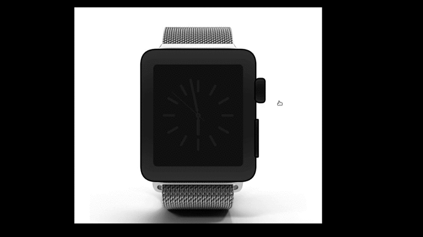

# ⌚ ProcessingClock2d

Desenvolvimento de um projeto usando os recursos do Processing de um relógio 2D para matéria de Computação Gráfica

  

## Descrição do projeto

O projeto consiste no desenvolvimento de um projeto 3D usando os recursos do Processing de um relógio de pulso. 

Neste projeto, funcionalidades deverão ser integradas empregando opções oferecidas pelo Processing:

  -  Uso dos botões do mouse pressionados com as variáveis mousePressed e mouseButton para executar ações diferentes. Por exemplo, pressionar um botão para mover uma peça do relógio, ou para mudar a cor da parte interna do relógio etc....
  -  Uso da variável booleana keyPressed para executar uma ação. Por exemplo, mudar a posição do relógio etc...
